# Hotel

## Ricreare database hotel come da diagramma

Prendere il diagramma e usando phpmyadmin ricreare il database,
inserire dei dati a piacere per poter effettuare le seguenti ricerche

## Ricerche da effettuare sul database

- selezionare tutti gli ospiti
- selezionare tutti gli ospiti che sono stati identificati con la carta di identitá
- selezionare tutte le stanze del primo piano
- selezionare tutti gli ospiti che iniziano per E (vedi uso del Like)
- Selezionare tutti gli ospiti che abbiano almeno 30 anni
- selezionare tutte le prenotazioni precedenti ad una data a piacere

## Altre ricerche (opzionali)

- seleziona tutti gli ospiti nati dopo una certa data
- calcola il totale degli ordini ricevuti
- calcola il prezzo massimo pagato
- calcola quanti posti letto ha l'hotel in totale

===

### Selezionare tutti gli ospiti

- SELECT * FROM `ospiti`;
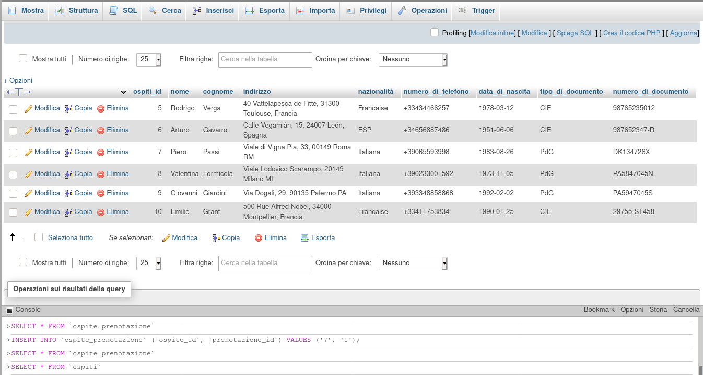

### Selezionare tutti gli ospiti che sono stati identificati con la carta di identitá

- SELECT * FROM `ospiti` WHERE `tipo_di_documento` = 'CIE';
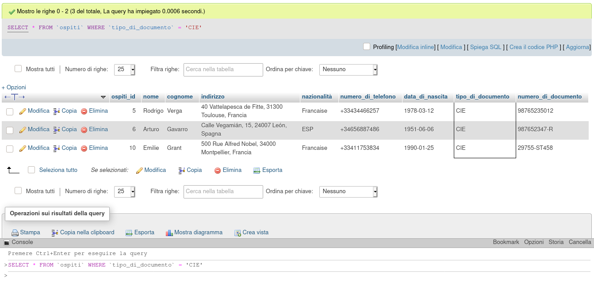

- SELECT * FROM `ospiti` WHERE `tipo_di_documento` = 'PdG';

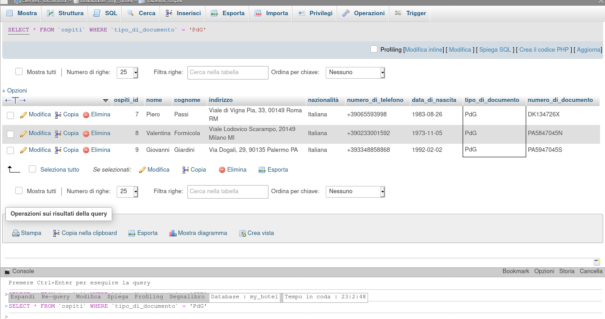

### Selezionare tutte le stanze del primo piano

- SELECT * FROM `stanze` WHERE `piano` = 1 ;

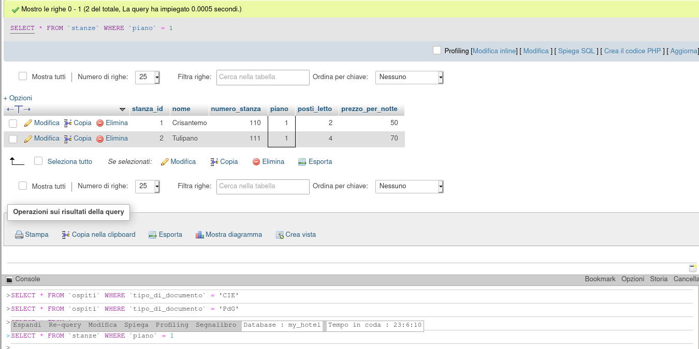

### Selezionare tutti gli ospiti che iniziano per E

- SELECT * FROM `ospiti` WHERE `nome` LIKE 'E%';

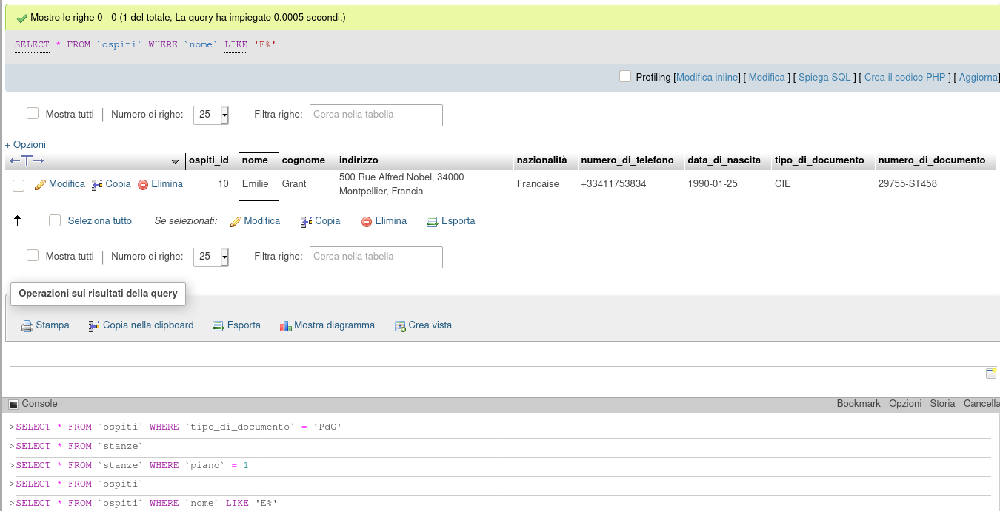

### Selezionare tutti gli ospiti che abbiano almeno 30 anni

- SELECT * FROM `ospiti` WHERE `data_di_nascita` <= SUBDATE(CURDATE(), INTERVAL 30 YEAR);

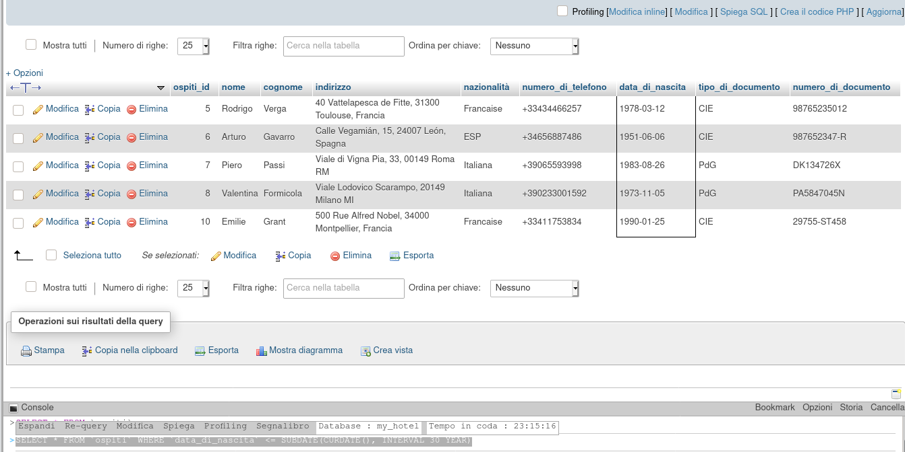

### Selezionare tutte le prenotazioni precedenti ad una data a piacere

- SELECT * FROM `prenotazioni` WHERE `check_in` < '2021-02-10' ORDER BY `prenotazioni`.`check_in` ASC;

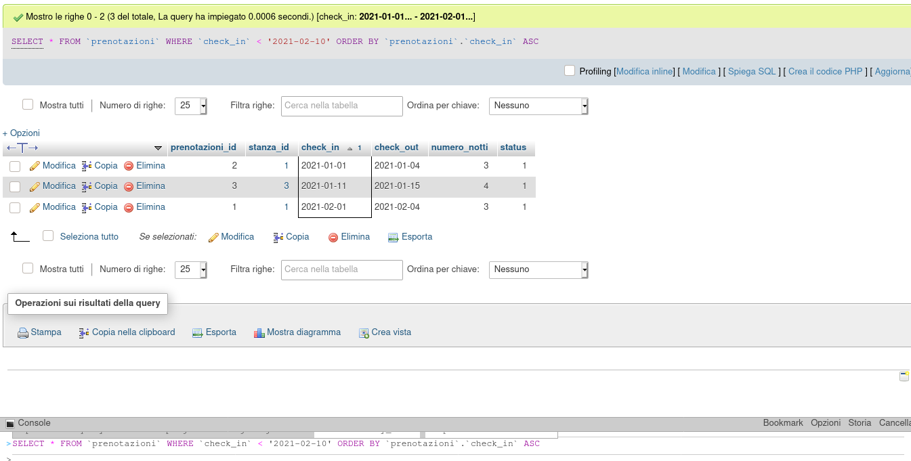

### Seleziona tutti gli ospiti nati dopo una certa data

SELECT * FROM `ospiti` WHERE `data_di_nascita` > '1990-01-15';

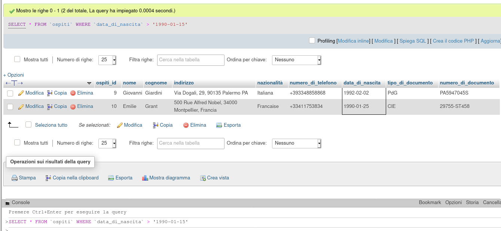

### Calcola il totale degli ordini ricevuti

- SELECT SUM(totale_pagamento) FROM `pagamenti` WHERE `status` = 'confermato';

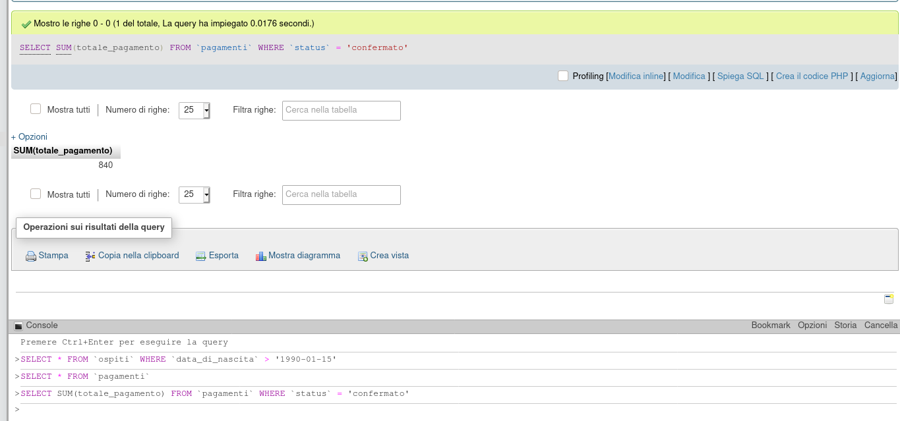

### Calcola il prezzo massimo pagato

- SELECT MAX(totale_pagamento) FROM `pagamenti` WHERE `status` = 'confermato';

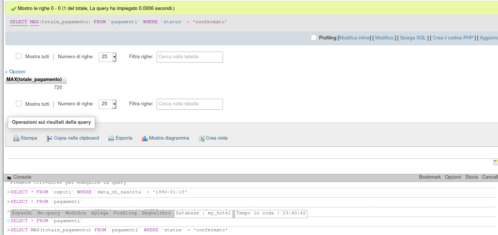

### Calcola quanti posti letto ha l'hotel in totale

- SELECT SUM(posti_letto) FROM `stanze`;

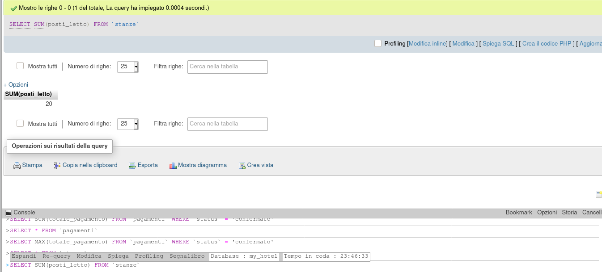